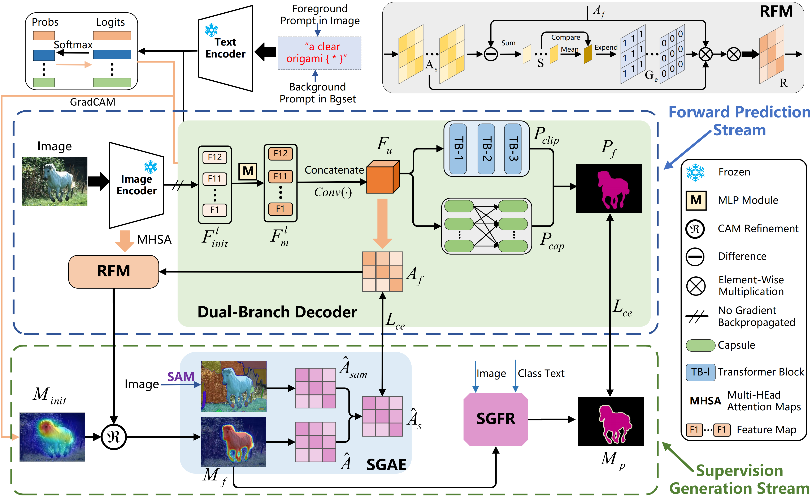

# FMCaps: Integrating Foundation Models with Capsule Networks for Enhanced Weakly-Supervised Semantic Segmentation

[](https://www.python.org/downloads/)
[](https://pytorch.org/)
[](https://opensource.org/licenses/MIT)


## 📋 Abstract

Weakly-Supervised Semantic Segmentation (WSSS) strives to achieve dense pixel-level predictions using only image-level annotations. This paper introduces **FMCaps**, a novel framework that synergistically integrates foundational models (CLIP, SAM, Grounding-DINO) with a capsule network module for enhanced performance.

**Key Contributions:**
- **SGFR Module**: SAM and Grounding-DINO Fusion Refinement for high-quality pseudo-label generation
- **SGAE Module**: SAM-Guided Affinity Enhancement for robust affinity learning
- **Capsule Network Integration**: Dynamic routing for structured object representations

**Results:**
| Dataset | Split | mIoU |
|---------|-------|------|
| PASCAL VOC 2012 | val | 78.2% |
| PASCAL VOC 2012 | test | 78.7% |
| MS COCO 2014 | val | 48.9% |

## 🏗️ Framework Overview
<p align="center">
  
</p>

## 🎨 Pseudo-Label Visualization

Our SGFR module generates high-quality pseudo-labels by combining SAM and Grounding-DINO. Below are visualization examples showing the comparison between input images, CAM-based pseudo-labels, and our SGFR-refined pseudo-labels.

### PASCAL VOC 2012
<p align="center">
  
</p>

### MS COCO 2014
<p align="center">
  
</p>

## 🔧 Installation

### Prerequisites
- Python 3.8+
- PyTorch 1.10+
- CUDA 11.0+

### Setup

```bash
# Clone the repository
git clone https://github.com/yourusername/FMCaps.git
cd FMCaps

# Create conda environment
conda create -n fmcaps python=3.8
conda activate fmcaps

# Install PyTorch (adjust CUDA version as needed)
pip install torch==1.12.0+cu113 torchvision==0.13.0+cu113 --extra-index-url https://download.pytorch.org/whl/cu113

# Install dependencies
pip install -r requirements.txt

# Install Grounding-DINO (optional, for SGFR)
pip install groundingdino-py

# Install SAM (optional, for SGFR and SGAE)
pip install segment-anything
```

## 📦 Data Preparation

### PASCAL VOC 2012

```bash
# Download VOC 2012
wget http://host.robots.ox.ac.uk/pascal/VOC/voc2012/VOCtrainval_11-May-2012.tar
tar -xvf VOCtrainval_11-May-2012.tar

# Download augmented annotations (SBD)
# Place in VOC2012/SegmentationClassAug/

# Expected structure:
VOC2012/
├── JPEGImages/
├── SegmentationClass/
├── SegmentationClassAug/
└── ImageSets/
    └── Segmentation/
        ├── train.txt
        ├── trainval.txt
        └── val.txt
```

### MS COCO 2014

```bash
# Download COCO 2014
wget http://images.cocodataset.org/zips/train2014.zip
wget http://images.cocodataset.org/zips/val2014.zip
wget http://images.cocodataset.org/annotations/annotations_trainval2014.zip

# Expected structure:
MSCOCO/
├── JPEGImages/
│   ├── train/
│   └── val/
├── SegmentationClass/
│   ├── train/
│   └── val/
└── ImageSets/
```

### Pre-trained Models

Download the CLIP pre-trained model:
```bash
mkdir -p pretrained
# Download ViT-B/16 from OpenAI CLIP
wget -P pretrained/ https://openaipublic.azureedge.net/clip/models/5806e77cd80f8b59890b7e101eabd078d9fb84e6937f9e85e4ecb61988df416f/ViT-B-16.pt
```

## 🚀 Usage

### Step 1: Generate High-Quality Pseudo Labels (SGFR)

```bash
# For PASCAL VOC
python tools/generate_pseudo_labels.py \
    --dataset voc \
    --data_root ./VOC2012 \
    --output_dir ./VOC2012/pseudo_labels_sgfr \
    --use_sam --use_gdino

# For MS COCO
python tools/generate_pseudo_labels.py \
    --dataset coco \
    --data_root ./MSCOCO \
    --output_dir ./MSCOCO/pseudo_labels_sgfr \
    --use_sam --use_gdino
```

### Step 2: Train Segmentation Network

```bash
# Train on PASCAL VOC with Capsule Network
python train_voc/voc_train_capsule_dic.py \
    --config configs/voc_attn_reg.yaml \
    --work_dir experiment_fmcaps_voc \
    --pseudo_label_dir ./VOC2012/pseudo_labels_sgfr

# Train on MS COCO with Capsule Network
python train_coco/coco_train_capsule_dic.py \
    --config configs/coco_attn_reg.yaml \
    --work_dir experiment_fmcaps_coco \
    --pseudo_label_dir ./MSCOCO/pseudo_labels_sgfr
```

### Step 3: Evaluation

```bash
# Evaluate on PASCAL VOC val set
python test_voc/test_msc_flip_voc.py \
    --config configs/voc_attn_reg.yaml \
    --checkpoint experiment_fmcaps_voc/checkpoints/best.pth \
    --save_dir results/voc_val

# Evaluate on MS COCO val set
python test_coco/test_msc_flip_coco.py \
    --config configs/coco_attn_reg.yaml \
    --checkpoint experiment_fmcaps_coco/checkpoints/best.pth \
    --save_dir results/coco_val
```

## 🙏 Acknowledgements

This project builds upon the following excellent works:
- [CLIP](https://github.com/openai/CLIP) - OpenAI's Contrastive Language-Image Pre-training
- [WeCLIP](https://github.com/zbf1991/WeCLIP) - Baseline WSSS method with CLIP
- [Segment Anything (SAM)](https://github.com/facebookresearch/segment-anything) - Meta's foundation model for segmentation
- [Grounding-DINO](https://github.com/IDEA-Research/GroundingDINO) - Open-set object detection

## 📄 License

This project is released under the [MIT License](LICENSE).

